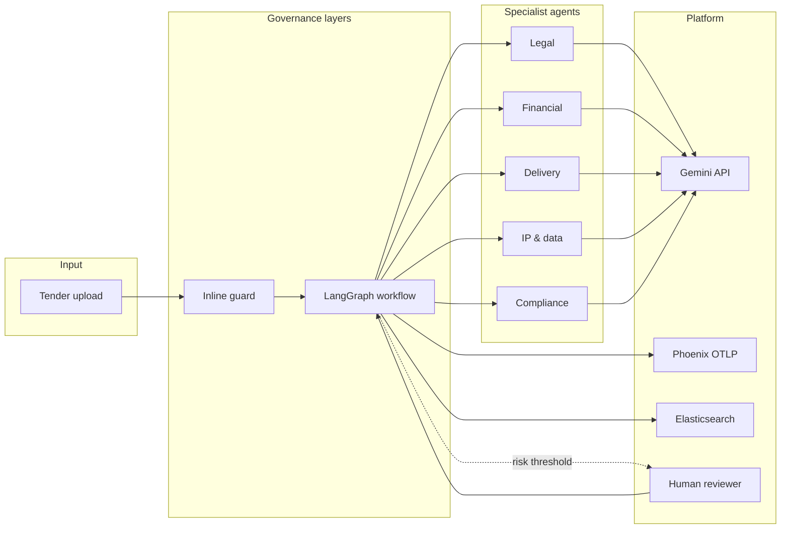
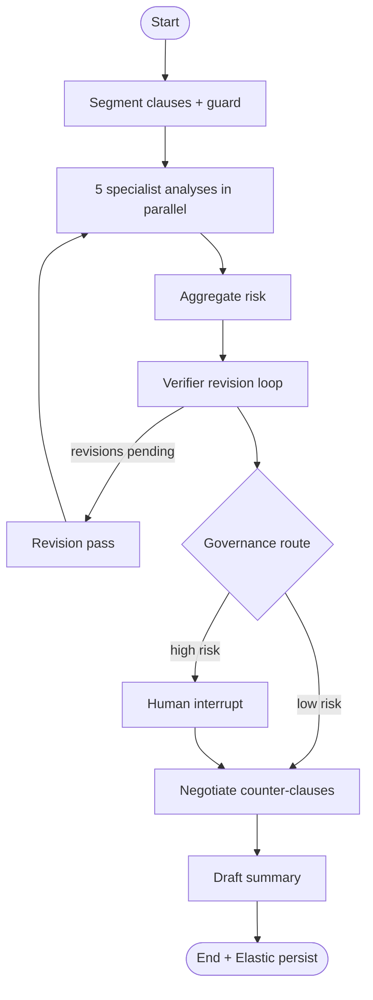
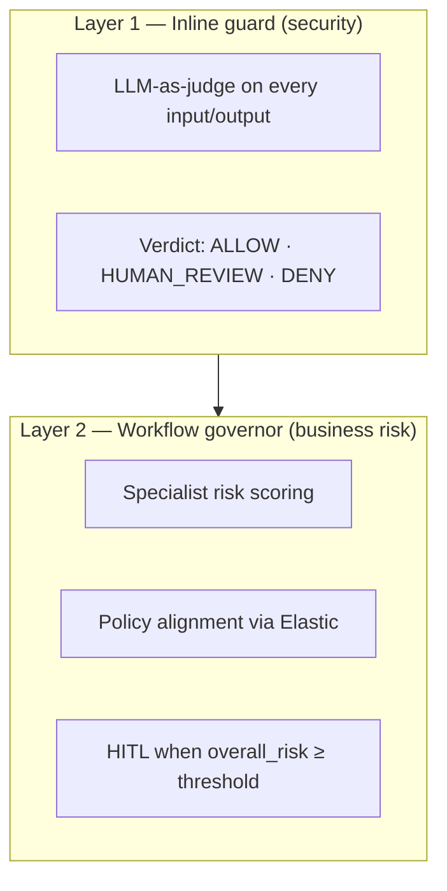
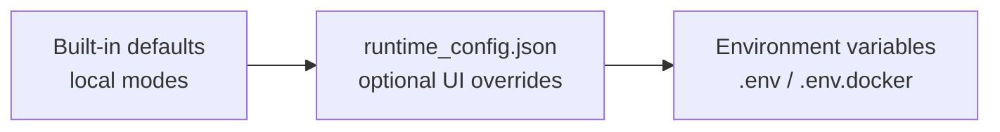
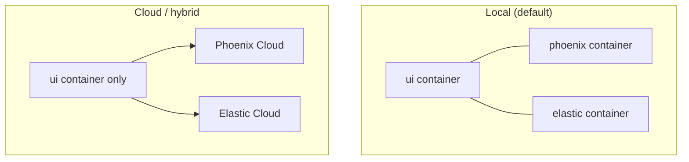

# Harbourmaster

<p align="center">
  
</p>

<p align="center">
  <strong>Governed multi-agent tender &amp; contract review control plane</strong><br/>
  Gemini · LangGraph · Arize Phoenix · Elasticsearch
</p>

<p align="center">
  <a href="#quick-start">Quick start</a> ·
  <a href="#architecture">Architecture</a> ·
  <a href="#configuration">Configuration</a> ·
  <a href="#remote-deployment">Remote deploy</a> ·
  <a href="#demo-flow">Demo</a>
</p>

---

Harbourmaster is a production-style governance layer for agentic procurement workflows. It reviews uploaded tenders with **five parallel specialist agents**, pauses for **human-in-the-loop** approval when risk is high, persists precedents in **Elasticsearch**, and streams every model call to **Arize Phoenix** for audit and evaluation.

## Why Harbourmaster

| Problem | How Harbourmaster addresses it |
|---------|--------------------------------|
| Prompt injection & unsafe inputs | Inline **guard** scores every prompt/response (`ALLOW` · `HUMAN_REVIEW` · `DENY`) |
| Generic models ignore corporate policy | Specialist agents + Elastic retrieval over indexed policies |
| No audit trail for agent decisions | OpenInference traces, governance dashboard, red-team experiments |
| Fully autonomous vs. manual review | LangGraph **interrupt/resume** — humans approve only when needed |
| Opaque multi-agent flows | Phoenix MCP + Governance Copilot for traces, datasets, and search |

## Architecture

<p align="center">
  
</p>

### High-level data flow



### LangGraph workflow



### Two governance layers



| Layer | Decides | Example |
|-------|---------|---------|
| **Inline guard** | Is this input/output an attack or policy violation? | Prompt injection in tender PDF text |
| **Workflow governor** | Is this clause commercially risky for our org? | High-risk indemnity → pause for lawyer |

## Partner integrations

### Arize Phoenix — observability & evaluation

- OpenInference tracing for every `GovernedLLM` call
- Governance dashboard fed from Phoenix spans
- Red-team suite synced as dataset/experiment metadata
- Governance Copilot via `@arizeai/phoenix-mcp` (traces, prompts, experiments)

### Elastic — procurement memory

- Indexes: policies, sample tenders, red-team prompts, review summaries, counter-clauses
- Retrieval injected into specialist analysis (clause-level evidence preserved)
- Governance Copilot via `@elastic/mcp-server-elasticsearch`

## Quick start

### Prerequisites

| Requirement | Version / notes |
|-------------|-----------------|
| Python | 3.10+ |
| Node.js | 18+ (`npx` for MCP servers) |
| Docker + Compose | Self-hosted Phoenix & Elastic (default) |
| Gemini API key | [Google AI Studio](https://aistudio.google.com/apikey) |

### 1. Install (local dev without Docker)

```bash
cp .env.example .env          # add GEMINI_API_KEY
make install
make config-check
make ui                         # http://localhost:8501
```

### 2. Run full stack (recommended)

```bash
cp .env.docker.example .env.docker   # add GEMINI_API_KEY
make run                             # ui + phoenix + elastic
```

`make run` is equivalent to:

```bash
docker compose --env-file .env.docker up --build
```

`.env.docker` sets `COMPOSE_PROFILES=local` so **ui**, **phoenix**, and **elastic** all start — no `--profile` flag needed.

| Service | URL (from host) |
|---------|-----------------|
| Streamlit UI | http://localhost:8501 |
| Phoenix console | http://localhost:6006 |
| Elasticsearch | http://localhost:9200 |

### 3. Smoke test

```bash
make smoke
make smoke-copilot
make config-check
```

## Configuration

Settings merge in this order (highest wins last):



| Variable | Default | Purpose |
|----------|---------|---------|
| `PHOENIX_MODE` | `local` | Self-hosted Phoenix vs Phoenix Cloud |
| `ELASTIC_MODE` | `local` | Compose Elasticsearch vs Elastic Cloud |
| `COMPOSE_PROFILES` | `local` (in `.env.docker`) | Start phoenix + elastic with ui |
| `GEMINI_API_KEY` | — | Workflow + Copilot LLM calls |
| `PHOENIX_BASE_URL` | `http://phoenix:6006` (Docker) | Server REST, OTLP, MCP |
| `PHOENIX_CONSOLE_URL` | `http://localhost:6006` | Browser sidebar links (set to your **public host** when deployed remotely) |
| `PHOENIX_PROJECT_ID` | — | Phoenix UI `/projects/{id}` path (auto-resolved from name if unset) |
| `PHOENIX_API_KEY` | — | Required when `PHOENIX_MODE=cloud` |
| `ELASTIC_URL` | `http://elastic:9200` (Docker) | Native client + MCP |
| `ELASTIC_API_KEY` | — | Required when `ELASTIC_MODE=cloud` |
| `MCP_ENABLED` | `true` | Master switch for Copilot MCP subprocesses |
| `MCP_PHOENIX_ENABLED` | `true` | `@arizeai/phoenix-mcp` |
| `MCP_ELASTIC_ENABLED` | `true` | `@elastic/mcp-server-elasticsearch` |

Use the **Configuration** page (`6_Configuration.py`) to preview resolved values, validate, and export an `.env` snippet. Environment variables always override saved runtime JSON.

```bash
make config-check
```

### Deployment modes



**Cloud / UI-only stack:**

```bash
cp .env.cloud.example .env.cloud
# fill PHOENIX_API_KEY and ELASTIC_API_KEY
make run-cloud
```

## Remote deployment

Run the full stack on any machine reachable over the network—a cloud VM, bare-metal server, homelab host, or VPS. The same Compose file works locally and remotely; only env values and exposed ports change.

**Prerequisites:** Docker and Docker Compose on the target host, outbound HTTPS for Gemini API calls, and firewall rules for the ports you publish.

1. **Copy and edit env**

```bash
cp .env.docker.example .env.docker
# Required: GEMINI_API_KEY
# Remote access: PHOENIX_CONSOLE_URL=http://<public-host-or-domain>:6006
```

For a minimal remote template, `.env.vps.example` is equivalent—copy either file to `.env.docker`.

2. **Start the stack**

Phoenix and Elastic start automatically when `COMPOSE_PROFILES=local` (included in the examples). Starting **only** `ui` without that profile leaves nothing listening on `phoenix:6006` / `elastic:9200`.

```bash
docker compose --env-file .env.docker up --build -d
```

3. **Open the app**

| Endpoint | Default port | Notes |
|----------|--------------|-------|
| Streamlit UI | `8501` | Main reviewer workflow |
| Phoenix console | `6006` | Traces and governance dashboard |

Override ports with `UI_PORT`, `PHOENIX_PORT`, and `ELASTIC_PORT` in `.env.docker` if needed.

**URL split (important on remote hosts):**

| Setting | Remote value | Why |
|---------|--------------|-----|
| `PHOENIX_BASE_URL` | `http://phoenix:6006` | Container-to-container (keep Compose service names) |
| `ELASTIC_URL` | `http://elastic:9200` | Container-to-container |
| `PHOENIX_CONSOLE_URL` | `http://<public-host>:6006` | Links opened in your browser |

Allow inbound traffic on the UI and Phoenix ports (or your custom `*_PORT` values). Elastic (`9200`) can stay internal unless you need direct access.

**After deploy:** run `make config-check` on the server or open **Configuration** in the UI to confirm resolved URLs. If a stale `runtime_config.json` still points at `localhost`, reset from the Configuration page or delete `configs/runtime_settings/runtime_config.json` on the host.

## Streamlit application

| Page | Route | Description |
|------|-------|-------------|
| Home | `/` | Upload tender, run workflow, HITL approve/reject |
| Review History | `/1_Review_History` | Past review artifacts |
| Governance Dashboard | `/2_Governance_Dashboard` | Phoenix telemetry & guard spans |
| Red Team Scorecard | `/3_Red_Team_Scorecard` | Adversarial test results |
| Corporate Policies | `/4_Corporate_Policies` | Manage procurement policies |
| Governance Copilot | `/5_Governance_Copilot` | Chat over traces + Elastic search (native + MCP) |
| Configuration | `/6_Configuration` | Modes, credentials, validation, env export |

## Demo flow

```bash
make run
make index-elastic
make demo SAMPLE=data/sample_tender_human_review.md
make redteam
```

Then open **Governance Copilot** and try:

- “Find similar high-risk indemnity clauses from prior tenders.”
- “Which policy passages support escalating this clause?”
- “Show precedent counter-clauses for IP ownership risk.”
- “Show the latest red-team experiment and key failures.”

## Make targets

| Command | What it does |
|---------|--------------|
| `make install` | Install Python deps + editable package |
| `make run` | Docker: ui + phoenix + elastic |
| `make run-cloud` | Docker: ui only (cloud backends) |
| `make ui` | Local Streamlit (no Docker) |
| `make demo` | CLI end-to-end tender review |
| `make redteam` | Adversarial suite + Phoenix experiment sync |
| `make index-elastic` | Seed Elastic with policies & samples |
| `make smoke` | Gemini + guard + graph smoke test |
| `make smoke-copilot` | Copilot health + native tools |
| `make config-check` | Print resolved settings + validation |
| `make dashboard` | Print Phoenix console & UI URLs |

## Project layout

```text
harbourmaster/          # Core package
  graph.py              # LangGraph workflow
  agents.py             # Specialists, segmenter, negotiator
  guard.py              # Inline ALLOW/HUMAN_REVIEW/DENY evaluator
  telemetry.py          # Phoenix OpenInference bootstrap
  elastic_store.py      # Indexing & retrieval
  copilot/              # Governance Copilot (native + MCP tools)
  settings.py           # Env + runtime config resolver
app/                    # Streamlit UI pages
configs/                # Policies, red-team cases, runtime overrides
scripts/                # CLI runners & smoke tests
assets/                 # Architecture diagram (SVG)
```

## Challenge fit

- **Real-world workflow** — multi-step procurement / tender governance
- **Human control** — LangGraph interrupt/resume at configurable risk threshold
- **Partner MCP depth** — Phoenix MCP for traces/evals; Elastic MCP for precedent search
- **Evaluation loop** — red-team datasets & experiments in Phoenix
- **Deployable** — local Compose by default, cloud/hybrid via env modes

## License

See [LICENSE](LICENSE).
